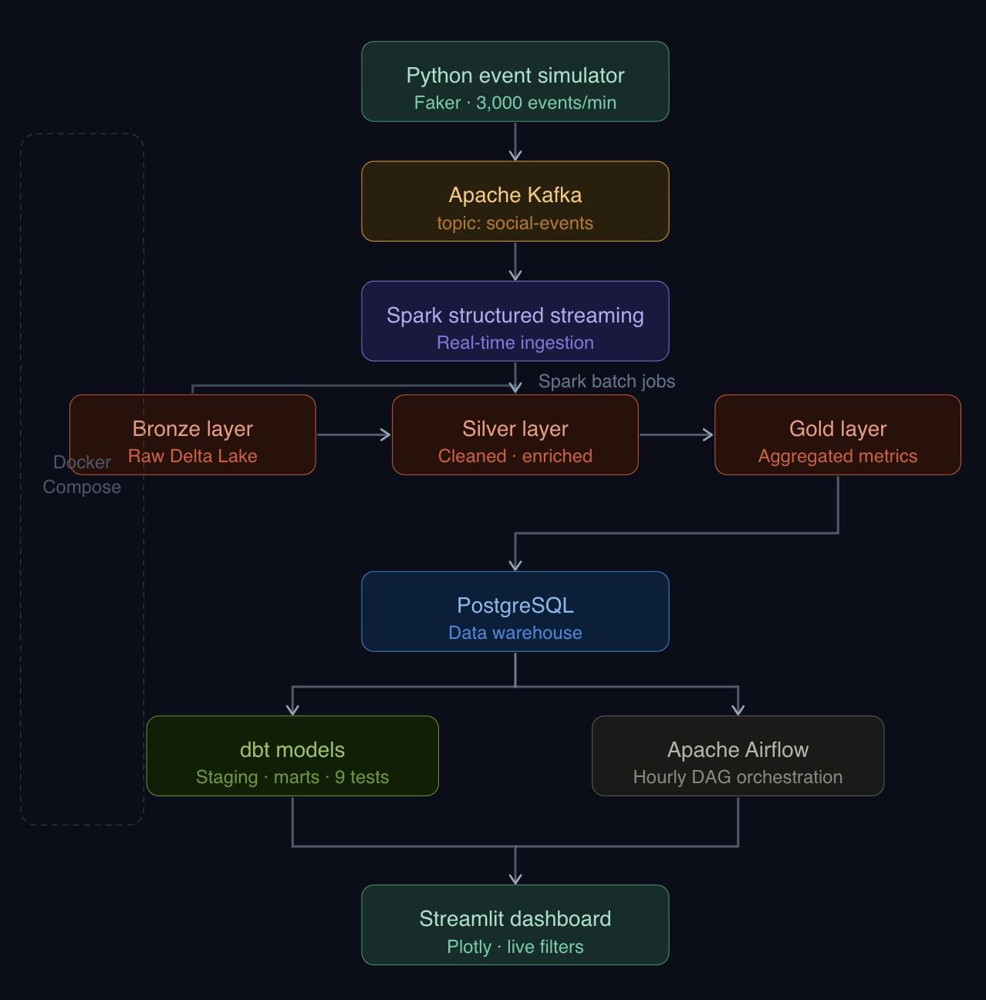

# ⚡ SocialPulse — Real-Time Social Media Analytics Platform

> An end-to-end streaming data pipeline that ingests, processes, and visualizes millions of social media events using industry-standard data engineering tools.


---

## 🏗️ Architecture



---

## 🛠️ Tech Stack

| Layer | Technology |
|---|---|
| Event Simulation | Python, Faker |
| Message Queue | Apache Kafka + Zookeeper |
| Stream Processing | Apache Spark Structured Streaming |
| Batch Processing | Apache Spark (PySpark) |
| Storage | Delta Lake (Bronze / Silver / Gold) |
| Data Warehouse | PostgreSQL |
| Transformation | dbt (data build tool) |
| Orchestration | Apache Airflow |
| Dashboard | Streamlit + Plotly |
| Infrastructure | Docker, Docker Compose |

---

## 📦 Project Structure

```
socialpulse/
├── simulator/
│   └── event_producer.py          # Kafka producer — generates 3K events/min
├── spark/
│   ├── streaming/
│   │   └── ingest_stream.py       # Spark Structured Streaming → Delta Lake Bronze
│   └── batch/
│       ├── bronze_to_silver.py    # Deduplicate, clean, enrich
│       ├── silver_to_gold.py      # Aggregate → top hashtags, user scores, trends
│       └── load_to_postgres.py    # Gold Delta Lake → PostgreSQL
├── dbt/
│   └── models/
│       ├── staging/               # Staging views on raw tables
│       │   ├── stg_top_hashtags.sql
│       │   └── stg_user_engagement.sql
│       └── marts/                 # Business-ready tables
│           └── mart_trending_topics.sql
├── airflow/
│   └── dags/
│       └── socialpulse_pipeline.py  # Hourly DAG: batch → load → dbt
├── dashboard.py                   # Streamlit analytics dashboard
├── docker-compose.yml             # Full infrastructure as code
└── README.md
```

---

## 🚀 Getting Started

### Prerequisites
- Docker Desktop
- Python 3.9+
- Java 17 (for Spark)

### 1. Clone the repo
```bash
git clone https://github.com/Junaita/Socialpulse.git
cd Socialpulse
```

### 2. Start infrastructure
```bash
docker compose up -d
```

### 3. Set up Python environment
```bash
python3 -m venv venv
source venv/bin/activate
pip install kafka-python faker pyspark==3.5.1 delta-spark==3.2.0 dbt-postgres streamlit plotly psycopg2-binary
```

### 4. Start the event producer
```bash
python3 simulator/event_producer.py
```

### 5. Start Spark Streaming
```bash
python3 spark/streaming/ingest_stream.py
```

### 6. Run batch pipeline manually
```bash
python3 spark/batch/bronze_to_silver.py
python3 spark/batch/silver_to_gold.py
python3 spark/batch/load_to_postgres.py
```

### 7. Run dbt models
```bash
cd dbt && dbt run && dbt test
```

### 8. Launch dashboard
```bash
streamlit run dashboard.py
```

### 9. Start Airflow (optional — automates steps 6-7 hourly)
```bash
export AIRFLOW_HOME=~/socialpulse/airflow
airflow scheduler &
airflow webserver --port 8090
```

---

## 📊 Dashboard Features

- 🏷️ **Top Trending Hashtags** — ranked by mention count with engagement color scale
- 🔥 **Engagement Tier Breakdown** — HOT / TRENDING / ACTIVE / NORMAL donut chart
- 💫 **Viral Rate by Hashtag** — percentage of posts that went viral
- 📈 **Hourly Event Distribution** — event volume by type across hours
- 👤 **User Engagement Leaderboard** — top 20 users with progress bars

**Sidebar Filters:**
- Engagement tier multiselect
- Top N hashtags slider
- Minimum mentions threshold
- Location filter
- Minimum engagement score

---

## 🔄 Data Pipeline

### Medallion Architecture

| Layer | Description | Format |
|---|---|---|
| **Bronze** | Raw events from Kafka, partitioned by event_type | Delta Lake |
| **Silver** | Deduplicated, cleaned, enriched with derived columns | Delta Lake |
| **Gold** | Aggregated: top hashtags, user scores, hourly trends | Delta Lake |

### Spark Streaming
- Reads from Kafka topic `social-events` in real-time
- Applies JSON schema parsing
- Writes to Bronze Delta Lake with checkpointing
- Computes 5-minute windowed trending hashtags

### dbt Models
- `stg_top_hashtags` — staging view on raw hashtag data
- `stg_user_engagement` — staging view on user engagement
- `mart_trending_topics` — top 10 hashtags with engagement tier and viral rate
- **9 data quality tests** across all models

### Airflow DAG
Runs hourly and executes tasks in order:
```
bronze_to_silver → silver_to_gold → load_to_postgres → dbt_run → dbt_test
```

---

## 📈 Scale

| Metric | Value |
|---|---|
| Events per minute | ~3,000 |
| Bronze layer (daily) | ~500MB–2GB |
| Silver layer (daily) | ~200MB–1GB |
| Users tracked | 23,000+ |
| Hashtags ranked | 18 |
| dbt tests | 9 |

---

## 🎯 Key Engineering Decisions

- **Delta Lake** over plain Parquet for ACID transactions and time travel
- **Medallion architecture** for clear data quality tiers
- **Separate Python venvs** for Airflow, dbt, and Spark to avoid dependency conflicts
- **Windowed aggregations** with watermarking for accurate late-data handling
- **Docker Compose** for reproducible local infrastructure


[](https://github.com/Junaita)
